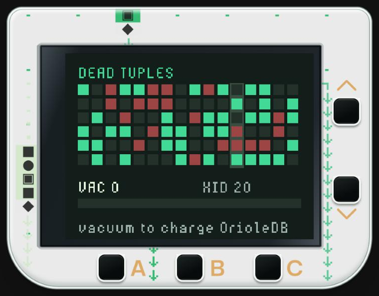
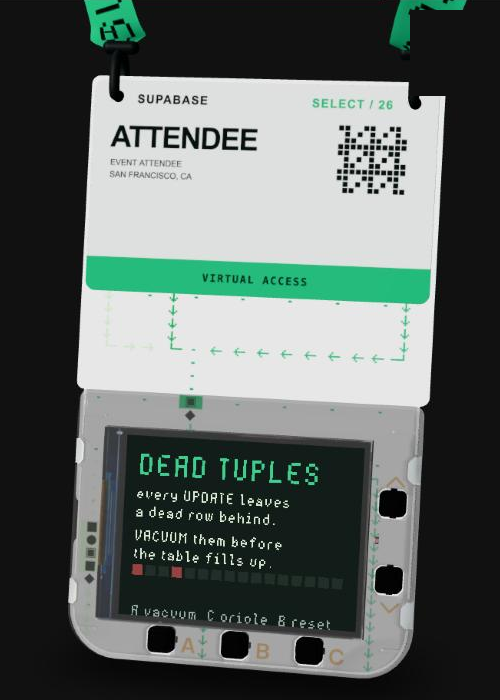

# Dead Tuples

A tiny arcade game for the Supabase Select 2026 badge (Pimoroni Tufty 2350), built from the OrioleDB section of the Select keynote.

In Postgres heap storage, every UPDATE leaves a dead row behind. VACUUM has to clean them up. If it falls behind, the table bloats, transaction IDs run out, and the database goes read-only.

This game makes you the vacuum.

  
  

## How to play

- **A**: vacuum the column under the cursor. Clear 3 or more at once for a CLEAN bonus.
- **C**: OrioleDB. Vacuuming charges the meter. When it's full, C switches on OrioleDB for 5 seconds: updates happen in place, so no dead rows and no vacuum.
- **B**: restart

Green rows are live. Red rows are dead. It speeds up as you go. Keep the table from filling up.

## Run it

1. Go to [badge.select](https://badge.select) and open **Make**
2. Click **Open file** and choose `__init__.py`
3. Press **Run**

Written in MicroPython with Badgeware. Timing uses the badge clock, so it plays at the same speed in the simulator and on the real badge.

Entry for #SelectBadge. Made by Amy Mayernik ([lfgamy.com](https://www.lfgamy.com)), founder of Dott, built on Supabase.
